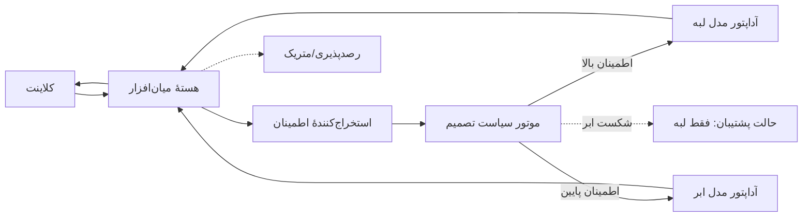

# چارچوب نرم‌افزاری تطبیقی برای استنتاج اطمینان‌محور LLM در محیط‌های لبه–ابر
## سند مشخصات فنی برای پیاده‌سازی (خودکفا — برای Claude Code)

> این فایل تنها منبع لازم برای شروع پیاده‌سازی است. اگر این فایل را در ریشهٔ یک پروژهٔ جدید با نام `CLAUDE.md` قرار دهی، Claude Code آن را به‌طور خودکار به‌عنوان زمینهٔ پروژه می‌خواند. هدف این سند این است که با خواندن آن — بدون نیاز به هیچ توضیح یا فایل دیگری — کاملاً روشن باشد: موضوع تز چیست، چرا مهم است، دقیقاً چه چیزی باید ساخته شود، به چه ترتیبی، و در پایان چه خروجی‌هایی لازم است تحویل داده شود.
>
> **دستورالعمل اجرا:** این پروژه قرار است در یک نشست پیوسته و خودکار پیاده‌سازی شود (نه به‌صورت یک برنامهٔ زمان‌بندی‌شدهٔ چند هفته‌ای). بخش ۱۲ («نقشهٔ راه اجرا») را به همان ترتیب دنبال کن؛ هر گام باید واقعاً کدنویسی و با معیار اتمام خودش تأیید شود (اجرای تست) پیش از رفتن به گام بعد. اگر جایی تصمیمی باز مانده (مثلاً انتخاب دقیق مدل)، در بخش ۱۵ پیش‌فرض‌های توصیه‌شده آمده — از آن‌ها استفاده کن و پیش برو، به‌جای توقف برای پرسش.

---

## ۱. زمینهٔ رسمی پروژه (عیناً از فرم پروپوزال دانشگاه)

| | |
|---|---|
| دانشجو | محمدمهدی میرزایی — کارشناسی ارشد، گرایش معماری کامپیوتر، دانشگاه صنعتی شریف |
| استاد راهنما | دکتر محسن انصاری |
| استاد راهنمای همکار | دکتر محمد امین فضلی |
| عنوان (فارسی) | یک چارچوب نرم‌افزاری تطبیقی برای استنتاج اطمینان‌محور مدل‌های زبانی بزرگ در محیط‌های لبه–ابر |
| عنوان (انگلیسی) | An Adaptive Software Framework for Confidence-Driven LLM Inference in Edge-Cloud Environments |
| کلمات کلیدی | مدل‌های زبانی بزرگ، استنتاج در لبه، محاسبات بی‌درنگ، تحمل‌پذیری اِشکال |
| ابزار ارزیابی مقرر | EdgeSimPy |

**شرح مختصر پروژه (متن دقیق فرم پروپوزال، بدون تغییر):**

> استقرار مدل‌های زبانی بزرگ در محیط‌های واقعی با دو چالش اساسی روبه‌روست. اجرای کامل این مدل‌ها روی سرورهای ابری هزینه‌بر است، مسائل حریم خصوصی ایجاد می‌کند و سیستم را به کیفیت شبکه وابسته می‌سازد. از سوی دیگر، اجرای آن‌ها صرفاً روی سرورهای لبه به دلیل محدودیت منابع محاسباتی، اغلب با افت کیفیت همراه است. روش‌های موجود برای ترکیب این دو محیط، تصمیم‌گیری را در سطح درخواست انجام می‌دهند؛ یعنی هر درخواست به‌طور کامل یا به لبه یا به ابر سپرده می‌شود. این رویکرد سطح تصمیم‌گیری کافی ندارد و نمی‌تواند از توانایی‌های هر دو محیط به‌صورت همزمان بهره ببرد.
>
> در این پروژه یک چارچوب نرم‌افزاری پیشنهاد می‌شود که تصمیم‌گیری را به سطح ریزتری می‌برد. نوآوری اصلی در دو بخش است: نخست، طراحی یک لایهٔ نرم‌افزاری میانی که به‌عنوان واسطی مستقل بین سرور لبه و سرور ابری عمل می‌کند و به‌گونه‌ای طراحی خواهد شد که قابل توسعه، قابل آزمون و مستقل از نوع مدل باشد. دوم، به‌کارگیری میزان اطمینان مدل در هر مرحله از تولید پاسخ به‌عنوان سیگنال تصمیم‌گیری؛ هرگاه سرور لبه در تولید بخشی از پاسخ اطمینان کافی نداشته باشد، همان بخش به سرور ابری واگذار می‌شود و بقیه در لبه باقی می‌ماند. این ترکیب میان معماری نرم‌افزار و بهره‌گیری از ویژگی‌های درونی مدل، رویکردی است که در ادبیات موجود پیشینه‌ای ندارد.
>
> هدف از این پروژه طراحی و پیاده‌سازی این چارچوب و سنجش کمّی آن از دو منظر است: الف) از منظر مهندسی نرم‌افزار، معماری پیشنهادی از نظر قابلیت نگهداری، گسترش‌پذیری و جداسازی مسئولیت‌ها ارزیابی می‌شود؛ ب) از منظر کارایی، معیارهایی نظیر بی‌درنگی، مصرف منابع محاسباتی و تحمل‌پذیری اِشکال در مقایسه با روش‌های پایه سنجیده می‌شود.

**مراحل رسمی مصوب پروژه (برنامهٔ ۱۲ماهه دانشگاه — برای اطلاع از انتظار کلی؛ نقشهٔ راه واقعی اجرا در بخش ۱۲ است):**
مطالعهٔ ادبیات ← بررسی روش‌های اندازه‌گیری اطمینان مدل ← طراحی معماری لایهٔ میانی و واسط‌ها ← پیاده‌سازی لایهٔ تصمیم‌گیر و یکپارچه‌سازی با بستر آزمایشی ← ارزیابی (بی‌درنگی، تحمل‌پذیری اشکال، مصرف منابع، کیفیت پاسخ) در برابر روش‌های پایه ← تدوین پایان‌نامه.

**دروس مرتبط:** مهندسی نیازمندی نرم‌افزار، رایانش لبه.

**مراجع رسمی پروپوزال (۸ مرجع):**

| # | مرجع | نقش در پروژه |
|---|---|---|
| [1] | Esnaashari, Ansari, Ejlali — "DReaM: Deep RL for Joint Reliability and Power Management in Multicore IoT Devices," IEEE IoT J., 2025 | زمینهٔ تحمل‌پذیری اشکال گروه پژوهشی |
| [2] | Rasouli, Esnaashari, Ansari — "RASOUL: A Reliability-Aware Task Allocation Strategy...," IEEE IoT J., 2025 | baseline تحمل‌پذیری اشکال |
| [3] | Zhang, Shen, Cao, Cui, Jiang — "EdgeShard: Efficient LLM Inference via Collaborative Edge Computing," IEEE IoT J., 2025 | baseline تقسیم مدل کلاسیک |
| [4] | Xu et al. — "EdgeLLM: Fast On-Device LLM Inference With Speculative Decoding," IEEE TMC, 2025 | معماری جایگزین (rejection-based)، نه سوییچ اطمینان‌محور |
| [5] | Wu, Jin — "CE-CoLLM: Efficient and Adaptive LLMs Through Cloud-Edge Collaboration," IEEE ICWS, 2025 | baseline نقطهٔ تقسیم ثابت |
| [6] | Li et al. — "SLED: A Speculative LLM Decoding Framework for Efficient Edge Serving," ACM/IEEE SEC, 2025 | baseline نقطهٔ تقسیم ثابت |
| [7] | Leviathan, Kalman, Matias — "Fast Inference from Transformers via Speculative Decoding," ICML, 2023 | مرجع پایه‌ای الگوریتمی (نه baseline مستقیم مقایسه) |
| [8] | Yang et al. — "QoS-Aware LLM Routing for Edge Computing with Multiple Experts," IEEE TMC, 2025 | baseline مسیریابی سطح‌درخواست (RL-based) |

---

## ۲. چرا این پروژه؛ دقیقاً چه چیزی نوآوری است

دو چالش بنیادین استقرار LLM: (۱) اجرای تمام‌وکمال روی ابر → هزینه بالا، ریسک حریم‌خصوصی، وابستگی به کیفیت شبکه؛ (۲) اجرای تمام‌وکمال روی لبه → محدودیت منابع محاسباتی، افت کیفیت پاسخ.

راه‌حل‌های موجود، تصمیم «لبه یا ابر» را **در سطح کل درخواست** می‌گیرند — یک مکالمه یا یک پاسخ، تمام‌وکمال یا لبه یا ابر. این گرانولاریتی برای بهره‌گیری هم‌زمان از هر دو محیط کافی نیست.

**نوآوری این پروژه در دو محور، به‌طور هم‌زمان:**

1. **معماری:** یک لایهٔ میان‌افزار مستقل، قابل‌آزمون، و مستقل از نوع مدل، بین سرور لبه و سرور ابر.
2. **سیگنال تصمیم:** میزان اطمینان خودِ مدل در هر مرحله (بخش/segment) از تولید پاسخ — نه در سطح کل درخواست. وقتی مدل لبه در تولید یک بخش از پاسخ اطمینان کافی ندارد، فقط همان بخش به ابر سپرده می‌شود؛ بقیهٔ پاسخ همچنان روی لبه تولید می‌شود.

هیچ کار منتشرشده‌ای این دو محور را با هم ترکیب نکرده است — این ادعای نوآوری اصلی پروپوزال است و باید در طراحی کد نیز رعایت شود (یعنی لایهٔ میان‌افزار نباید به یک مدل خاص وابسته شود، و تصمیم باید واقعاً در سطح توکن/بخش گرفته شود، نه کل درخواست).

---

## ۳. جایگاه در ادبیات موجود (خلاصهٔ رقابتی — چرا این طراحی نه طراحی‌های دیگر)

سه شکاف اصلی که این پروژه پر می‌کند:

- **سطح دانه‌بندی تصمیم:** تقریباً همهٔ کارهای مرتبط در سطح درخواست/مدل/لایه تصمیم می‌گیرند، نه در سطح بخش پاسخ.
- **جدایی معماری از سیاست تصمیم:** کارهایی با معماری میان‌افزار/microservice مستقل معمولاً منطق تصمیمشان مبتنی بر اطمینان مدل زبانی نیست.
- **خلأ تحمل‌پذیری اشکال مختص LLM:** هیچ کار شناخته‌شده‌ای هم‌زمان تحمل‌پذیری اشکال و استنتاج LLM لبه-ابر را پوشش نمی‌دهد.

| کار مرتبط | رویکرد | سطح تصمیم | تفاوت کلیدی با این پروژه |
|---|---|---|---|
| Active Inference (He & Fang, IEEE TMC 2024) | free-energy principle به‌جای RL معمول | کل درخواست | نزدیک‌ترین از نظر «مفهوم عدم‌قطعیت»، اما نه در سطح توکن/بخش |
| QoS-Aware Routing [8] | SAC + انتزاع پویای حالت | کل درخواست | مسیریابی RL-based، نه سیگنال اطمینان لحظه‌ای مدل |
| Cost-Aware Layer Allocation (Habibi & Ercetin, IEEE Access 2025) | مزایدهٔ هزینه/تأخیر/حافظه + زمان‌بند ADSA | لایهٔ مدل | تصمیم بر پایهٔ هزینه، نه اطمینان |
| Task Offloading for LLM Agents (IEEE MASS 2025) | الگوریتم حریصانهٔ دومرحله‌ای | زیروظیفهٔ عامل | نه سطح توکن داخل یک پاسخ |
| Serving Long-Context LLMs (IEEE/ACM ToN 2026) | RL زمان‌آزمون برای کش مدل | کش/مدل | تمرکز روی هزینه، نه کیفیت پاسخ در حین تولید |
| **Accuracy-Delay Trade-Off via Token-Level Uncertainty** (arXiv:2602.07958؛ پذیرفته‌شده در IEEE Globecom Workshop 2025، هنوز بدون DOI رسمی IEEE) | عدم‌قطعیت مبتنی بر margin **در سطح توکن** + Greedy Offloading Algorithm | **کل کوئری** (عدم‌قطعیت توکن‌ها تجمیع می‌شود) | **نزدیک‌ترین رقیب شناخته‌شده.** سیگنال توکنی است اما تصمیم هنوز سطح کوئری است، نه سوییچ میان‌تولیدی درون یک پاسخ. مرز نوآوری این پروژه دقیقاً همین‌جاست: سوییچ در وسط تولید یک پاسخ واحد، در سطح بخش/segment. |
| EdgeLLM speculative decoding [4] / SLED [6] | تأیید حدسی (draft-then-verify) | توکن، اما بر پایهٔ تطابق دو مدل نه اطمینان صریح | معماری جایگزین برای شتاب‌دهی، نه چارچوب سوییچ اطمینان‌محور |

**نتیجهٔ عملی برای پیاده‌سازی:** کد باید تصمیم سوییچ را روی یک پنجرهٔ لغزان از چند توکن اخیر (نه کل درخواست) بگیرد و امکان چند بار سوییچ رفت‌وبرگشت در طول یک پاسخ واحد را فراهم کند (نه فقط یک تصمیم دودویی ابتدای درخواست).

---

## ۴. معماری کلی سیستم

چهار لایهٔ منطقی: **کلاینت**، **هستهٔ میان‌افزار (Middleware Core)**، **آداپتورهای مدل لبه/ابر**، و یک لایهٔ **رصدپذیری سبک** (صرفاً لاگ ساختاریافته، نه زیرساخت مانیتورینگ جداگانه).



**مسیر یک درخواست:** کلاینت درخواست را به هستهٔ میان‌افزار می‌فرستد؛ تولید پاسخ روی مدل لبه آغاز می‌شود؛ پس از هر بخش (segment) از توکن‌های تولیدشده، استخراج‌کنندهٔ اطمینان معیار را محاسبه و به موتور سیاست می‌دهد؛ اگر اطمینان از آستانه پایین‌تر بیاید، موتور سیاست دستور سوییچ به ابر را صادر می‌کند و زمینهٔ تولیدشده تاکنون به آداپتور ابر منتقل می‌شود؛ در غیر این صورت تولید روی لبه ادامه می‌یابد. این چرخه تا پایان پاسخ یا رسیدن به شرط توقف تکرار می‌شود.

---

## ۵. اصول طراحی (عمداً حداقلی — از پیچیدگی الکی خودداری کن)

فقط سه اصل عملی، نه فهرست کامل الگوهای معماری کلاسیک:

1. **جداسازی مسئولیت‌ها:** سه بخش مجزا — اجرای مدل، سنجش اطمینان، تصمیم مسیریابی — هرکدام در یک فایل/کلاس جدا، بدون وابستگی مستقیم به جزئیات داخلی هم.
2. **رابط ساده برای مدل:** هر دو مدل (لبه و ابر) از یک کلاس/تابع با همان امضا (`prefill`، `next_token`) استفاده می‌کنند؛ افزودن یا تعویض مدل بدون تغییر بقیهٔ کد ممکن باشد.
3. **سیاست تصمیم قابل‌تعویض:** تابع تصمیم (آستانهٔ ثابت در نسخهٔ اول) به‌صورت یک تابع مجزا نوشته می‌شود تا بعداً بدون دست‌زدن به بقیهٔ کد با نسخهٔ پیچیده‌تر جایگزین شود.

**مدیریت خطا** هم ساده نگه داشته می‌شود: اگر تماس با ابر شکست بخورد یا خیلی طول بکشد، همان درخواست به‌سادگی روی لبه ادامه پیدا می‌کند (`try/except` + timeout). **نیازی به circuit breaker یا زیرساخت جداگانه نیست.**

> ⚠️ یادآوری صریح: این پروژه یک نمونهٔ اولیهٔ پژوهشی برای پایان‌نامه است، نه یک محصول production. از افزودن Prometheus/Grafana، OpenTelemetry، gRPC+Protobuf، Docker، مجموعه CI رسمی، یا فرایند ADR رسمی **خودداری کن**، مگر اینکه در عمل واقعاً لازم شود.

---

## ۶. اجزای کلیدی چارچوب

| ماژول | مسئولیت | ورودی | خروجی |
|---|---|---|---|
| Confidence Extractor | محاسبهٔ معیار اطمینان از logits هر توکن | logits/احتمالات توکن | نمره اطمینان (۰ تا ۱) |
| Decision Policy Engine | تصمیم ادامه در لبه یا سوییچ به ابر | نمرات اطمینان بازهٔ اخیر، آستانه | دستور مسیر (لبه/ابر) |
| Model Adapter (Port) | اجرای واقعی مدل، پنهان‌کردن جزئیات backend | متن/زمینه | توکن بعدی + logits |
| Edge-Cloud Communication Layer | انتقال زمینه و توکن‌های تولیدشده هنگام سوییچ | زمینهٔ تولیدشده، متادیتا | جریان توکن ادامه‌یافته |
| Fault Tolerance Module | مدیریت شکست ابر/لبه و بازگشت به حالت پشتیبان | وضعیت سلامت سرویس | مسیر جایگزین |
| Observability | ثبت متریک، لاگ ساختاریافته | رویدادهای سیستم | فایل CSV/JSON قابل تحلیل |

رابط انتزاعی آداپتور مدل (پایتون؛ قرارداد، نه پیاده‌سازی نهایی):

```python
class ModelBackend(Protocol):
    def prefill(self, context: str) -> KVState:
        pass
    def next_token(self, state: KVState):
        pass
    def name(self) -> str:
        pass
```

هر backend جدید (لبه یا ابر) فقط باید این سه متد را پیاده کند؛ هستهٔ میان‌افزار هیچ فرضی دربارهٔ نوع مدل نمی‌کند.

---

## ۷. سیگنال اطمینان و سیاست تصمیم‌گیری

سه گزینهٔ کم‌هزینه (بدون forward pass اضافه)، مستقیماً از softmax خروجی هر توکن:

- حداکثر احتمال softmax
- آنتروپی توزیع پیش‌بینی
- فاصلهٔ حاشیه‌ای (margin) بین دو توکن برتر — همان معیاری که در نزدیک‌ترین رقیب شناخته‌شده («Token-Level Uncertainty») استفاده شده

برای قابل‌مقایسه‌بودن بین مدل لبه و ابر (که اندازه‌های متفاوتی دارند)، یک مرحلهٔ **کالیبراسیون با temperature scaling** روی یک مجموعهٔ اعتبارسنجی لازم است.

**سیاست تصمیم:** روی یک پنجرهٔ لغزان از k توکن اخیر اعمال می‌شود (پیشنهاد اولیه k=۴ تا ۸). اگر میانگین اطمینان پنجره از آستانهٔ τ پایین‌تر بیاید، سوییچ به ابر رخ می‌دهد. τ و k هر دو پارامتر قابل‌تنظیم‌اند و در فاز ارزیابی روی آن‌ها جاروب (sweep) انجام می‌شود.

---

## ۸. چالش فنی کلیدی: تداوم زمینه هنگام سوییچ (KV-Cache)

مشکل اصلی مهندسی: وضعیت داخلی مدل (KV-cache) قابل‌انتقال مستقیم بین دو backend متفاوت نیست. راه‌حل:

1. **خانوادهٔ مدل مشترک:** مدل لبه نسخهٔ کوانتیزه/کوچک‌شدهٔ همان خانوادهٔ مدل ابر باشد (مثلاً همان خانواده در دو اندازه)؛ تضمین می‌کند tokenizer یکسان است و re-prefill معنادار خواهد بود.
2. **Re-prefill به‌جای انتقال حالت:** هنگام سوییچ، متن تولیدشده تاکنون (نه وزن‌های مدل) به backend جدید داده می‌شود و آن backend یک prefill سریع روی این متن انجام می‌دهد؛ هزینه فقط در لحظهٔ سوییچ رخ می‌دهد، نه به‌ازای هر توکن.
3. **کش پیشوند (Prefix Caching):** در صورت وجود، برای کاهش هزینهٔ re-prefill تکراری.
4. **محدودکردن نقاط سوییچ به مرز جمله/بند:** سوییچ فقط در مرز جمله یا بند مجاز است تا تعداد دفعات re-prefill و سربار کنترل‌شده بماند — یک مصالحهٔ صریح بین گرانولاریتی تصمیم و سربار عملیاتی که باید در فاز ارزیابی سنجیده شود.

---

## ۹. پشتهٔ فناوری (حداقلی، عمداً ساده)

- زبان: **Python**
- اجرای مدل: **Hugging Face Transformers** برای هر دو مدل لبه (نسخهٔ کوچک/کوانتیزه) و ابر (نسخهٔ کامل) — یک کتابخانهٔ واحد، بدون ترکیب چند framework
- شبیه‌سازی شبکه و منابع: **EdgeSimPy** (طبق پروپوزال رسمی)
- ثبت نتایج: لاگ ساده CSV/JSON برای تأخیر، نرخ سوییچ، مصرف منابع؛ رسم نمودار بعداً با pandas/matplotlib
- تست: **pytest**

همین. اگر واقعاً نیاز به ارتباط شبکه‌ای واقعی بین دو سرور جدا شد (نه فقط شبیه‌سازی)، یک فراخوانی HTTP ساده با FastAPI کافی است؛ چیزی پیچیده‌تر (gRPC، صف پیام) فقط در صورت نیاز واقعی، نه از پیش.

---

## ۱۰. استراتژی تست

دو سطح کافی است:

1. **تست واحد** برای دو بخش حساس: محاسبهٔ اطمینان (آیا معیار درست حساب می‌شود؟) و تصمیم مسیریابی (آیا نزدیک آستانه درست تصمیم می‌گیرد؟).
2. **یک تست سرتاسری** با مدل‌های کوچک واقعی (نه mock) که کل مسیر یک درخواست را از اول تا آخر چک کند، شامل هم حالت بدون سوییچ و هم حالت با سوییچ به ابر.

مستندسازی: هر ماژول یک docstring کوتاه دارد که می‌گوید چه‌کاری می‌کند و چرا. نیازی به فرایند رسمی ADR یا ابزارهای اندازه‌گیری coupling/cohesion در این مقیاس نیست — کد تمیز و خوانا خودش گواه کیفیت است.

---

## ۱۱. طرح ارزیابی (خروجی نهایی برای فصل ارزیابی پایان‌نامه)

**معیارهای عملکردی:** تأخیر سرتاسری (P50/P95/P99)، زمان تا اولین توکن (TTFT)، نرخ سوییچ به ابر، مصرف منابع لبه (CPU/GPU/حافظه)، حجم دادهٔ منتقل‌شده در شبکه، و کیفیت پاسخ (BERTScore یا ارزیابی انسانی) در برابر تأخیر.

**معیارهای تحمل‌پذیری اشکال:** زمان بازیابی پس از شبیه‌سازی قطعی ابر، نرخ موفقیت درخواست‌ها هنگام قطع شبکه.

**پایه‌های مقایسه (baselines):**
- همیشه-لبه و همیشه-ابر (کران‌های ساده، حتماً باید باشند)
- RASOUL [2]، EdgeShard [3] (تقسیم مدل کلاسیک)
- CE-CoLLM [5] / SLED [6] (نقطهٔ تقسیم ثابت)
- QoS-Aware Routing [8] (تصمیم درخواستی مبتنی بر RL)
- Cost-Aware Layer Allocation، Active Inference (اختیاری، در صورت زمان کافی؛ Active Inference از نظر مفهومی نزدیک‌ترین baseline است)

اولویت با ۲ تا ۳ baseline نزدیک‌تر (Active Inference، Cost-Aware Layer Allocation، و همیشه-لبه/همیشه-ابر) است تا زمان پیاده‌سازی همهٔ baselineها صرف نشود.

**طراحی آزمایش:** ماتریس سناریوهای EdgeSimPy روی سه محور — شرایط شبکه (پهنای‌باند/تأخیر)، نوع وظیفه، و سطح منابع لبه — با چند اجرای تکراری برای گزارش بازهٔ اطمینان آماری. به‌علاوه جاروب پارامترهای τ و k.

---

## ۱۲. نقشهٔ راه اجرا (توالی اجرا، نه زمان‌بندی تقویمی — دنبال کن به همین ترتیب)

هر گام وقتی تمام می‌شود که تست/معیار مربوط به آن سبز شود و بلافاصله وارد گام بعد می‌شوی؛ هر گام روی نتیجهٔ گام قبل ساخته می‌شود.

| گام | چه‌ساخته می‌شود | معیار اتمام گام |
|---|---|---|
| ۱. اسکلت پروژه | ساختار پوشه‌ها، نصب وابستگی‌ها (transformers، EdgeSimPy، pytest) | یک تست خالی با pytest سبز می‌شود |
| ۲. رابط ModelBackend + دو پیاده‌سازی | EdgeModelAdapter (مدل کوچک) و CloudModelAdapter (مدل بزرگ‌تر) از همان خانواده | هر دو مدل جداگانه یک جمله را کامل تولید می‌کنند |
| ۳. Confidence Extractor | تابع محاسبهٔ اطمینان از logits | تست واحد با logits ساختگی سبز می‌شود |
| ۴. Decision Policy | تابع تصمیم آستانهٔ ثابت روی پنجرهٔ k توکن | تست مرزی نزدیک آستانه سبز می‌شود |
| ۵. حلقهٔ اصلی میان‌افزار | تولید توکن‌به‌توکن روی لبه + سوییچ به ابر با re-prefill هنگام افت اطمینان | یک درخواست نمونه از اول تا آخر پاسخ می‌دهد |
| ۶. مدیریت خطا | try/except دور تماس با ابر + بازگشت به لبه هنگام شکست | قطع شبیه‌سازی‌شدهٔ ابر باعث کرش نشود |
| ۷. تست سرتاسری | یک درخواست کامل بدون سوییچ + یک درخواست با سوییچ | هردو مسیر بدون خطا کامل می‌شوند |
| ۸. وصل به EdgeSimPy | اجرای همان میان‌افزار درون یک سناریوی شبیه‌سازی‌شده (تأخیر/پهنای‌باند) | سناریو بدون خطا اجرا می‌شود |
| ۹. ارزیابی کوچک | مقایسهٔ همیشه-لبه در برابر سیاست آستانه‌ای روی چند سؤال نمونه | نتیجه در CSV ذخیره و قابل‌مرور می‌شود |
| ۱۰. مرور نهایی | خواندن کد، افزودن docstring، نوشتن README کوتاه | کد بدون کمک قابل‌فهم است |

پس از تکمیل این ۱۰ گام، در صورت وجود زمان/منابع کافی، می‌توان baselineهای بیشتری (بخش ۱۱) و جاروب کامل پارامتر τ/k را اضافه کرد — اما این‌ها خارج از حداقل خروجی لازم (بخش ۱۳) هستند.

---

## ۱۳. خروجی‌های نهایی مورد نیاز (Deliverables)

**باید تحویل داده شود:**

- یک ریپازیتوری/بستهٔ پایتون کارکردی با ساختار ماژولار منطبق بر جدول بخش ۶ (هر مسئولیت در فایل/ماژول جدای خودش).
- مجموعه تست pytest سبز شامل تست‌های واحد + تست سرتاسری (بخش ۱۰).
- اسکریپت یکپارچه‌سازی با EdgeSimPy (گام ۸ نقشهٔ راه) که حداقل یک سناریوی شبکه‌ای را اجرا می‌کند.
- اسکریپت آزمایش مقایسه‌ای که حداقل «همیشه-لبه» را در برابر «سیاست آستانه‌ای پیشنهادی» روی چند نمونه سؤال اجرا کرده و نتایج را در CSV/JSON ذخیره می‌کند (گام ۹).
- یک README کوتاه که می‌گوید چطور محیط را نصب کرد، تست‌ها را اجرا کرد، و آزمایش مقایسه‌ای را دوباره تکرار کرد.
- docstring مختصر روی هر ماژول کلیدی.

**در صورت وجود زمان (اختیاری، نه حداقل لازم):** افزودن baselineهای بیشتر از بخش ۱۱، جاروب پارامتر τ/k، گزارش کالیبراسیون temperature scaling، نمودارهای pandas/matplotlib از نتایج CSV.

**عمداً خارج از محدودهٔ این فاز (نساز، مگر واقعاً لازم شود):** رابط وب/UI، بسته‌بندی Docker، خط CI رسمی، زیرساخت مانیتورینگ (Prometheus/Grafana/OpenTelemetry)، مستندسازی رسمی ADR، پروتکل ارتباطی پیچیده (gRPC/Protobuf) — این‌ها برای یک نمونهٔ اولیهٔ پژوهشی پایان‌نامه اضافه‌کاری محسوب می‌شوند.

---

## ۱۴. ریسک‌های کلیدی و راهکار کاهش

| ریسک | راهکار کاهش |
|---|---|
| هزینهٔ re-prefill مزیت تأخیری را خنثی کند | محدودکردن سوییچ به مرز جمله + prefix caching |
| عدم‌تطابق کالیبراسیون اطمینان بین مدل لبه/ابر | مرحلهٔ کالیبراسیون جداگانه با temperature scaling روی هر مدل |
| EdgeSimPy پشتیبانی بومی از شبیه‌سازی توکن‌محور LLM نداشته باشد | یک اسپایک (spike) کوتاه در ابتدای کار برای تأیید/توسعهٔ افزونهٔ لازم |
| زمان‌بر بودن پیاده‌سازی همهٔ baselineهای سروی | اولویت با ۲ تا ۳ baseline نزدیک‌تر (بخش ۱۱) به‌جای همه |
| هزینهٔ API مدل‌های ابری در آزمایش‌های مکرر | استفاده از مدل‌های متن‌باز خودمیزبان برای کنترل کامل و تکرارپذیری |

---

## ۱۵. یادداشت‌های پایانی برای Claude Code

- **پیچیدگی الکی اضافه نکن.** این دستور صریح صاحب پروژه است. اگر جایی وسوسه شدی زیرساخت اضافه کنی (مانیتورینگ، صف پیام، containerization)، به بخش ۹ و ۱۳ برگرد و از آن پرهیز کن، مگر در عمل واقعاً لازم شود.
- **انتخاب پیش‌فرض مدل** (برای رفع ابهام و امکان اجرای خودکار بدون توقف): یک جفت مدل هم‌خانواده و کوچک، مثلاً نسخهٔ کوچک/کوانتیزه (edge) و نسخهٔ بزرگ‌تر همان خانواده (cloud) از یک خانوادهٔ متن‌باز رایج (مانند Qwen2.5 یا Llama در دو اندازه). اگر منابع محاسباتی محیط اجرا محدود است، از کوچک‌ترین جفت ممکن که هنوز تفاوت کیفیت محسوسی دارد استفاده کن.
- **اگر تصمیمی باز ماند** که در این سند پوشش داده نشده، منطقی‌ترین گزینهٔ سازگار با اصول بخش ۵ (ساده، قابل‌نگهداری، قابل‌آزمون) را انتخاب کن و در README یا docstring مربوطه یک جملهٔ کوتاه دربارهٔ این تصمیم بنویس؛ برای ادامهٔ کار متوقف نشو.
- بخش‌های ۱–۳ این سند («چرا») و بخش‌های ۴–۱۴ («چه‌کاری و چطور») باید در طول پیاده‌سازی هم‌راستا بمانند: هر تصمیم طراحی باید نوآوری بخش ۲ (سوییچ در سطح بخش/segment درون یک پاسخ واحد، نه سطح درخواست) را واقعاً پیاده کند — این همان چیزی است که این پروژه را از نزدیک‌ترین رقیب شناخته‌شده (بخش ۳) متمایز می‌کند.
